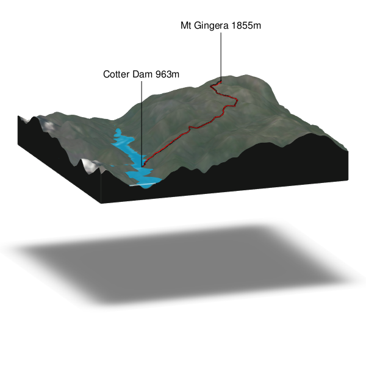

# geoviz_rayshader_example
sample code for geoviz and rayshader, cobbled together from the package developers great examples found here [geoviz](https://github.com/neilcharles/geoviz) and here [rayshader](https://www.rayshader.com/).
Code should produce this image:

I have also attempted a little code to import track data from .tcx files
